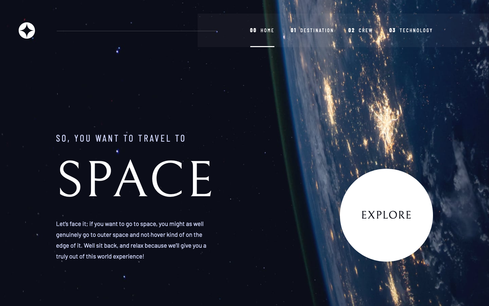

# Frontend Mentor - Space tourism website solution

This is a solution to the [Space tourism website challenge on Frontend Mentor](https://www.frontendmentor.io/challenges/space-tourism-multipage-website-gRWj1URZ3). Frontend Mentor challenges help you improve your coding skills by building realistic projects.

## Table of contents

- [Overview](#overview)
  - [The challenge](#the-challenge)
  - [Screenshot](#screenshot)
  - [Links](#links)
- [My process](#my-process)
  - [Built with](#built-with)
  - [Useful resources](#useful-resources)
- [Author](#author)

## Overview

### The challenge

Users should be able to:

- View the optimal layout for each of the website's pages depending on their device's screen size
- See hover states for all interactive elements on the page
- View each page and be able to toggle between the tabs to see new information

### Screenshot

### Links

- Solution URL: [https://www.frontendmentor.io/solutions/space-tourism-multipage-website-using-react-j5dta0HUm](https://www.frontendmentor.io/solutions/space-tourism-multipage-website-using-react-j5dta0HUm)
- Live Site URL: [https://nakoyawilson.github.io/space-tourism-website/](https://nakoyawilson.github.io/space-tourism-website/)

## My process

### Built with

- HTML
- CSS
- Mobile-first workflow
- [React](https://reactjs.org/)
- [React Router](https://reactrouter.com/)

### Useful resources

- [How to implement Hamburger Menu in React](https://ibaslogic.com/how-to-add-hamburger-menu-in-react/)
- [How to Deploy a Routed React App to GitHub Pages](https://www.freecodecamp.org/news/deploy-a-react-app-to-github-pages/) - This was helpful for understanding why I needed to use HashRouter instead of BrowserRouter.

## Author

- Website - [Nakoya Wilson](https://nakoyawilson.netlify.app/)
- Frontend Mentor - [@nakoyawilson](https://www.frontendmentor.io/profile/nakoyawilson)
- Twitter - [@nakoyawilson](https://twitter.com/nakoyawilson)
- LinkedIn - [@nakoyawilson](https://www.linkedin.com/in/nakoyawilson/)
